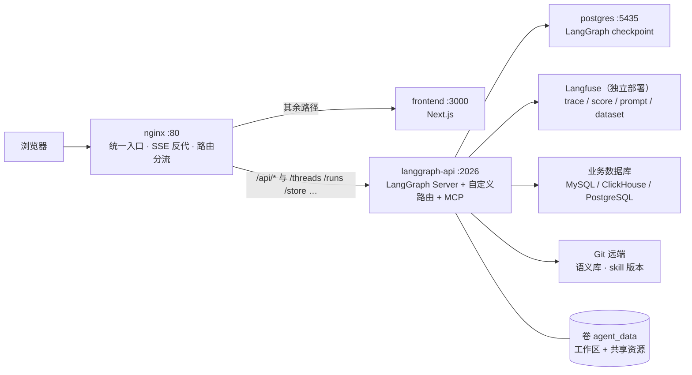
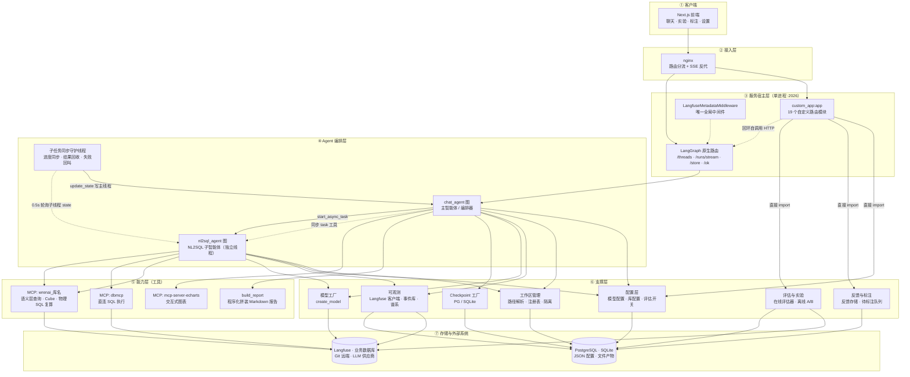
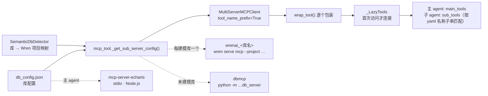
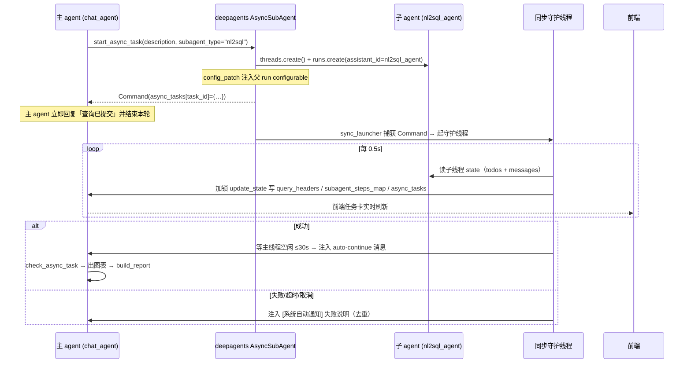
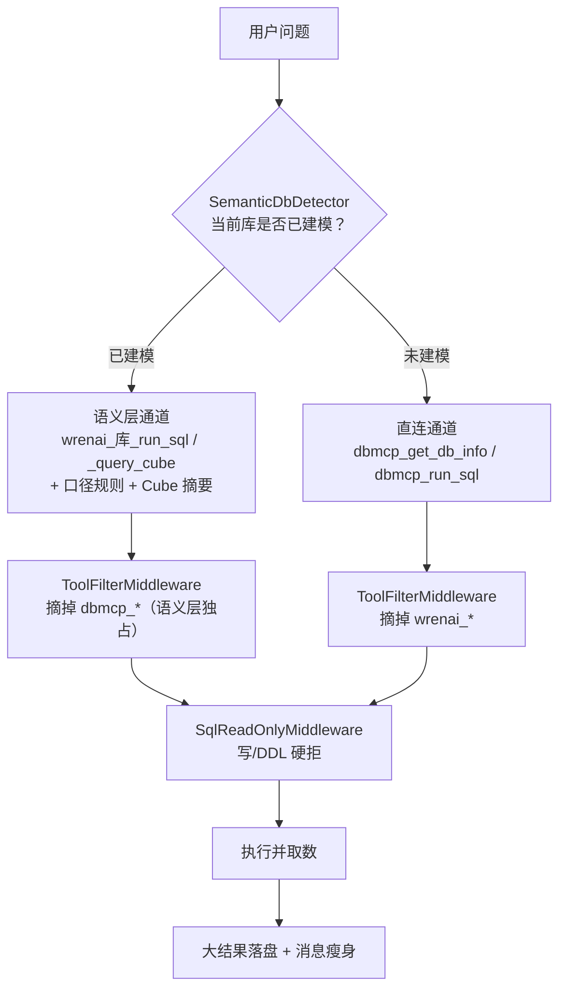
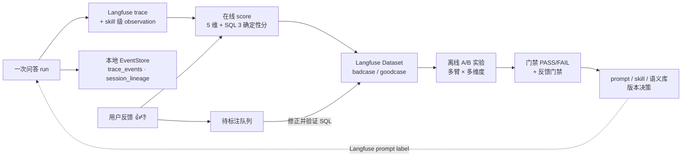
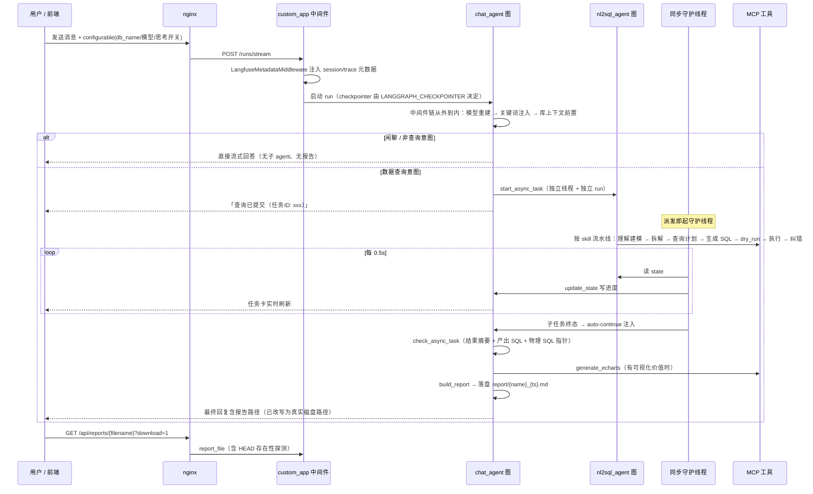
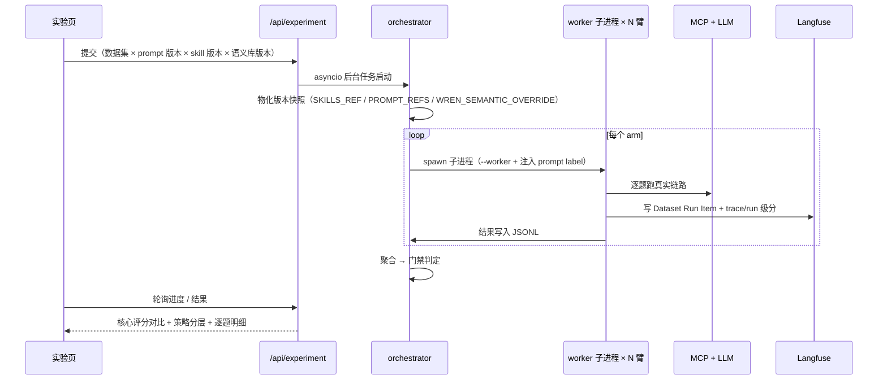

# NL2SQL 后端（含 Agent）设计与实现方案

> 用途：本文档描述 NL2SQL 后端与 Agent 的分层结构、组件职责、关键机制与数据流，供后续生成**后端架构图**使用。
> 口径：**一切以代码为准**。仓库内 `ARCHITECTURE.md` 的中间件顺序章节（`:329` / `:331`）已过期（漏了框架层中间件、顺序与代码不一致），本文按实际构造顺序重列。
> 本文不含任何密钥、连接串与密码明文。

---

## 目录

- [1. 系统概览](#1-系统概览)
- [2. 分层架构](#2-分层架构)
- [3. 组件清单（按层）](#3-组件清单按层)
- [4. 关键机制设计](#4-关键机制设计)
- [5. 关键时序](#5-关键时序)
- [6. 存储全景](#6-存储全景)
- [7. 外部依赖](#7-外部依赖)
- [8. 设计决策与权衡](#8-设计决策与权衡)
- [9. 已知边界与演进方向](#9-已知边界与演进方向)
- [附录 A：画图要素速查（节点 / 连线）](#附录-a画图要素速查节点--连线)

---

## 1. 系统概览

### 1.1 定位

一个**面向中文自然语言取数**的多智能体后端：用户一句话提问 → 系统判断是否需要取数 → 需要则异步委派给 NL2SQL 子智能体 → 子智能体走「语义层 / 直连」双通道生成并执行 SQL → 主智能体出图表与 Markdown 分析报告。

围绕这条主链路，后端同时承担：工作区隔离、语义库 Git 版本化、模型接入与切换、上下文治理、全链路可观测、在线评估与离线 A/B 实验、反馈闭环。

### 1.2 技术栈

| 关注点 | 选型 |
|---|---|
| 服务宿主 | LangGraph API Server（`langgraph_api.server:app`）由自建 uvicorn 拉起，**单进程**，端口 `2026` |
| 图编排 | `deepagents.create_deep_agent()`（底层 langchain `create_agent`），两个图：`chat_agent` / `nl2sql_agent` |
| HTTP 路由 | Starlette `Route` 列表（**非 FastAPI 装饰器**），经 `LANGGRAPH_HTTP.app` 钩子并入同一进程同一端口 |
| 检查点 | PostgreSQL（生产）/ SQLite（dev），自定义 checkpointer 工厂 |
| 工具协议 | MCP（stdio）：`wrenai_<库>`（语义层）、`dbmcp`（直连）、`mcp-server-echarts`（图表） |
| 语义层 | Wren（MDL 模型 + Cube 语义层 + 物理 SQL 编译） |
| 可观测 | Langfuse（自托管 v4）+ 本地 SQLite 事件库（自包含追踪） |
| 评估 | 在线五维评估器 + 离线 A/B 实验（多进程 worker） |
| 运行时 | Python ≥ 3.13，`.venv`（`uv run python`） |

### 1.3 部署拓扑（生产）



- `nginx` 按路径分流：`/api/` 与 `^/(threads|runs|assistants|store|ok|docs|openapi)` → 后端（显式关 `proxy_buffering`、600s 超时以保 SSE），其余 → 前端。
- Langfuse 及其自身 PG/ClickHouse **不在本 compose 内**，是宿主机上独立部署的实例。
- MCP server **不单独起容器**，由 `langgraph-api` 进程内以 stdio 子进程方式装载（图表 MCP 依赖容器内 Node.js 20）。

---

## 2. 分层架构

### 2.1 分层总览



### 2.2 各层职责边界

| 层 | 职责 | 不负责 |
|---|---|---|
| ① 客户端 | 交互、局部状态、关键词本地判断、进度轮询 | 不做业务判定（除并发提示） |
| ② 接入层 | 路由分流、SSE 透传 | 无鉴权、无 CORS 处理（同源经 nginx） |
| ③ 服务宿主 | 图运行、线程/状态管理、自定义业务 API | 不承载业务规则 |
| ④ Agent 编排 | 意图识别、任务分解、异步委派、结果装配 | 不直接写 SQL（交给子智能体工具） |
| ⑤ 能力层 | 工具实现：查询、图表、报告 | 不做权限决策（由中间件护栏把关） |
| ⑥ 支撑层 | 工作区、配置、持久化、追踪、评估、反馈 | 不参与对话编排 |
| ⑦ 存储与外部 | 状态持久化与外部服务 | — |

---

## 3. 组件清单（按层）

### 3.1 ② 接入层

| 组件 | 一句话职责 |
|---|---|
| `docker/nginx.conf` | 统一入口；`/api/` 与 LangGraph 原生路径转发后端并关闭 buffering 保 SSE，其余转发前端 |

### 3.2 ③ 服务宿主层

#### 3.2.1 启动装配（`start_server.py`）

| 步骤 | 内容 |
|---|---|
| 1 | 固定 CWD 到仓库根（防内存注册表漂移） |
| 2 | 注入 `LANGGRAPH_RUNTIME_EDITION=inmem`、`DATABASE_URI=:memory:` 等内存版 LangGraph 参数 |
| 3 | **MCP 启动预检**：关键 server（`wrenai_*` / `dbmcp`）未就绪则拒绝启动；`MCP_ALLOW_DEGRADED=1` 可显式降级 |
| 4 | Langfuse 连通性告警（不阻断启动） |
| 5 | `uvicorn.run(langgraph_api.server:app, host=0.0.0.0, port=2026)` |

#### 3.2.2 自定义路由装配（`src/api/custom_app.py`）

- **装配方式**：每个模块自行导出 `routes: list[BaseRoute]`，组合根用列表展开拼成单个 Starlette app，暴露变量名 `app`，由 `LANGGRAPH_HTTP.app` 钩子并入 LangGraph 进程。
- **全局中间件**：仅 1 个 —— `LangfuseMetadataMiddleware`（纯 ASGI，非 `BaseHTTPMiddleware`；只拦 `POST` 的 run 创建路径，缓冲请求体注入 Langfuse `config.metadata`，**不缓冲响应**以保 SSE）。
- **全局 lifespan**：仅停机 flush Langfuse 上送队列。
- **共享工具**：`src/api/_common.py` 的 `parse_body()` / `json_response()`；在各 handler 内联解析 JSON，**不使用**包裹整个 app 的 JSON 中间件（会破坏 SSE 路由）。

**19 个路由模块（按业务域）** 

| 业务域 | 模块 | 前缀 / 职责 |
|---|---|---|
| 配置 | `db_config.py` | `/api/db-configs`、`/healthz`：数据库连接 CRUD + 连通性测试 + 脱敏列表 |
| 配置 | `model_config.py` | `/api/model-configs`：LLM provider CRUD / 激活 / 探活 / 能力探测 |
| 配置 | `workspace.py` | `/api/workspaces`：工作区注册 / 激活 / 注销 / 彻底删除 |
| 配置 | `eval_flags.py` | `/api/eval-flags`：在线评估开关（override / env / 代码默认值三层） |
| 会话 | `message_feedback.py` | `/api/threads/{tid}/…feedback`、`/api/feedback/export`：点赞/点踩、撤销、回显、导出 |
| 会话 | `auto_title.py` | `/api/auto-title`：首条问题 → ≤20 字会话标题（无状态，不读 checkpointer） |
| 会话 | `thread_compact.py` | `/api/threads/{tid}/compact`：手动上下文压缩（LLM 摘要 + RemoveMessage 裁剪） |
| 会话 | `thread_export.py` | `/api/threads/{tid}/export`：会话导出 Markdown / JSON |
| 会话 | `thread_fork.py` | `/api/threads/{tid}/fork`：整线程复制 / 指定消息锚点回退分叉 |
| 会话 | `thread_search.py` | `/api/threads/fts`：会话全文搜索（SQLite FTS5 + trigram 中文子串） |
| 会话 | `thread_run_status.py` | `/api/threads/{tid}/run-status`：run 状态四+一判据查询（治「被外部打断后前端永久转圈」） |
| 会话 | `sql_approval.py` | `/api/threads/{sid}/sql-approval`：SQL 审批恢复（approve / reject / edit）——**当前为休眠兼容代码** |
| 会话 | `task_cancel.py` | `/api/threads/{task_id}/cancel`：取消异步子任务（读主线程 `async_tasks` → 真取消子 run → 回写终态） |
| 语义库 | `wren_semantic.py` | `/api/wren-projects`、`/api/git-ssh-key`：语义库全生命周期（20 条路由，最大模块） |
| 评估反馈 | `experiment.py` | `/api/experiment`：离线 A/B 实验（后台任务 + 状态轮询，四维度） |
| 评估反馈 | `feedback_annotation.py` | `/api/feedback/annotations`、`/api/feedback/datasets`：待标注队列、judge / execute / confirm |
| 评估反馈 | `feedback_stats.py` | `/api/feedback/stats`：好评率、信噪比、每日趋势 |
| 可观测 | `trace_routes.py` | `/api/traces`：事件列表、会话谱系、统计投影、LLM 调用清单、跨 thread 子任务事件 |
| 文件 | `report_file.py` | `/api/reports/{filename}`：报告预览 / 下载（RFC 5987 中文名）/ HEAD 存在性探测 |

#### 3.2.3 API 层触达 Agent 的三种方式（本项目显著特征）

| 方式 | 说明 | 代表 |
|---|---|---|
| **A. HTTP 回环自调用** | 用 `LANGGRAPH_API_URL` 配 `httpx` 调自家原生端点，复用官方 thread/state 语义 | `thread_compact` / `thread_export` / `thread_fork` / `thread_search` / `sql_approval` / `task_cancel` / `message_feedback` |
| **B. 进程内直接 import** | 绕过图，直接调用 agent 内部模块 | `auto_title`（直建 LLM 生成标题）、`experiment`（起后台实验）、`feedback_annotation`、`thread_compact`、`wren_semantic`、`db_config` |
| **C. 共享存储层** | API 与 agent 读写同一份 SQLite / JSON，形成隐式边界 | 反馈库、事件库、评估开关、模型配置、工作区注册表 |

> 画图提示：这三条路径是「API 层 ↔ Agent 层」之间的真实连线，其中 A 是回环、B 是直插、C 是共享存储。

### 3.3 ④ Agent 编排层

#### 3.3.1 两个图

| 图名（assistant_id） | 文件 | 暴露变量 | 状态类型 | 构建方式 |
|---|---|---|---|---|
| `chat_agent`（主智能体/编排器） | `src/agent/main_agent.py` | `agent` | `MainAgentState(DeepAgentState)` | `create_deep_agent()` |
| `nl2sql_agent`（NL2SQL 子智能体） | `src/agent/graphs/nl2sql_agent.py` | `agent` | 框架默认 `DeepAgentState` | `create_deep_agent()` |

- 两图均 `.with_config({"recursion_limit": 500, "callbacks": get_langfuse_callbacks()})`。
- 图自身不设 checkpointer，由 `LANGGRAPH_CHECKPOINTER` 在 langgraph_api 层统一配置。
- **没有任何手写 `StateGraph` / `add_node`**，全部由 `create_deep_agent` 生成。
- 注册入口两份等价配置：`langgraph.json`（`langgraph dev` 用）与 `graph.json`（`start_server.py` 用）。

`MainAgentState` 在框架状态之上扩展：
- `todos`：任务清单
- `async_tasks`：按 `task_id` 键控的异步任务表
- `query_headers` / `subagent_steps_map` / `active_queries`：按 task_id 键控（自定义 reducer `_merge_dict_by_key`，支持并发不互相覆盖）
- `token_stats`：token 与耗时统计（reducer `_accumulate_token_stats`）

#### 3.3.2 主/子智能体关系

**两条委派通道并存：**

| 通道 | 工具 | 来源 | 特点 |
|---|---|---|---|
| **异步（主用）** | `start_async_task` / `check_async_task` / `update_async_task` / `cancel_async_task` / `list_async_tasks` | deepagents `AsyncSubAgentMiddleware`，配置 `AsyncSubAgent(name="nl2sql", graph_id="nl2sql_agent")` | 立即返回，子任务在**独立线程**跑独立 run |
| **同步** | `task` | deepagents `create_deep_agent` 自动补的 inline 子 agent `general-purpose` | 阻塞等待 |

异步派发内部行为：
```
client.threads.create()                      # 新建独立线程
client.runs.create(thread_id=新线程,
                   assistant_id="nl2sql_agent",
                   input={"messages":[{"role":"user","content":description}]})
→ Command(update={"messages":[ToolMessage], "async_tasks":{task_id: {...}}})
```
**`task_id` 即子线程的 thread_id。**

**配置透传**：框架原生 `runs.create` 不传 `config`，项目通过 monkey-patch（`middlewares/deepagents_async_config_patch.py`，导入即生效）包装 client 的 `runs.create`，把父 run 的 `configurable` **过滤后**注入子 run：

- 丢弃 `thread_id` / `checkpoint_id` / `checkpoint_ns`、`__` 前缀、`langgraph_` 前缀（`__pregel_*` 不可序列化会直接报错）
- 额外注入 `trace_parent_thread_id`（父 thread_id）与 Langfuse metadata，供子 agent 建会话谱系

因此 `db_name` / `llm_route` / `llm_model` / `enable_thinking` 由前端 → 主 run → patch → 子 run 贯通。

**子 agent 不继承父的任何中间件对象**：子图自行重建 backend / permissions / middleware / tools / prompt。

#### 3.3.3 主智能体中间件链（最终顺序，外 → 内）

框架层先注入，用户层追加在其后，最后是 profile / prompt-cache / memory。

| # | 中间件 | 来源 | 职责 |
|---|---|---|---|
| 1 | `TodoListMiddleware` | 框架 | 提供 `write_todos` 工具 |
| 2 | `FilesystemMiddleware` | 框架 | 文件工具（read/write/edit/ls/glob/grep/execute），吃 `permissions` |
| 3 | `SubAgentMiddleware` | 框架 | 同步 `task` 工具 + `general-purpose` 子 agent |
| 4 | `SummarizationMiddleware` | 框架 | 上下文自动压缩（offload 到 `/workspace/`） |
| 5 | `PatchToolCallsMiddleware` | 框架 | run 起点修补孤儿 tool_call |
| 6 | `AsyncSubAgentMiddleware` | 框架 | 5 个异步任务工具 |
| 7 | `QuotaErrorMiddleware` | 自研 | 额度耗尽 → 友好中文 AIMessage，不抛异常 |
| 8 | `ModelTimeoutMiddleware` | 自研 | LLM 超时 → 友好中文 AIMessage |
| 9 | `ExecuteGuardMiddleware` | 自研 | execute/shell 护栏：拦破坏性命令与工作区外路径 |
| 10 | `SkillsMiddleware` | 框架类 + 自研装配 | 加载 `/shared/skills/main/` 技能（sources 可被 `SKILLS_REF` 换版） |
| 11 | `QueryKeywordsMiddleware` | 自研 | 按 `configurable.query_keywords` 注入「触发关键词」行（命中标记则原位替换，缺失则末尾追加——见 §9 边界 4） |
| 12 | `ThinkingToggleMiddleware` | 自研 | 按 `configurable` **每次模型调用重建模型** |
| 13 | `MessageSlimmerMiddleware` | 自研 | 工具结果进 checkpoint 前瘦身：超大落盘截断 + 完全重复去重 |
| 14 | `CurrentDbContextMiddleware` | 自研 | 把 `configurable.db_name` 作为前缀拼进**最新用户消息**，压过历史陈旧库名 |
| 15 | `DanglingToolCallsMiddleware` | 自研 | 为孤儿 `tool_call_id` 补合成 ToolMessage，防模型 400 |
| 16 | `dynamic_prompt` | 自研 | 把「当前数据库」段**前置**到 system prompt 顶部 |
| 17 | `TokenMeterMiddleware` | 自研 | 记录每次 LLM 耗时与各类 token 用量 |
| 18 | `TraceRecorderMiddleware` | 自研 | 事件采集落本地 EventStore |
| 19 | `LangfuseSpanMiddleware` | 自研 | 关键工具边界包 skill 级 span |
| 20 | `VfsPathResolverMiddleware` | 自研 | 最终 AIMessage 的 VFS 路径 → 真实磁盘路径（**必须在最内层**） |
| 21 | `_profile.materialize_extra_middleware()` | 框架 | 默认 profile 为空 |
| 22 | `_ToolExclusionMiddleware` | 框架 | 仅 profile 有排除项时生效 |
| 23 | `AnthropicPromptCachingMiddleware` | 框架 | 非 Anthropic 模型 no-op |
| 24 | `MemoryMiddleware` | 框架 | 注入 `/shared/memory/ORCHESTRATOR.md` |
| 25 | `HumanInTheLoopMiddleware` | 框架 | **未挂载**（权限规则无 `mode="interrupt"`） |

#### 3.3.4 子智能体中间件链（最终顺序，外 → 内）

| # | 中间件 | 职责 |
|---|---|---|
| 0 | `ModelTimeoutMiddleware` | LLM 超时 → 友好消息（`insert(0)`，最外） |
| 1 | `QuotaErrorMiddleware` | 额度耗尽 → 友好消息 |
| 2 | `TraceRecorderMiddleware` | 事件采集（`agent_type="nl2sql_agent"`） |
| 3 | `SkillsMiddleware` | 加载 `/shared/skills/nl2sql/`（受 `SKILLS_REF` 影响） |
| 4 | `ProgressTrackerMiddleware` | 从 `write_todos` ToolMessage 提取进度与每步耗时 → 本地进度文件 |
| 5 | `ProgressBoundaryMiddleware` | **确定性推进**：`after_model` 按工具名分桶，单调推进里程碑，不靠模型自觉 |
| 6 | `DanglingToolCallsMiddleware` | 补孤儿 tool 响应，防 400 |
| 7 | `ThinkingToggleMiddleware` | 按 `configurable` 重建模型 |
| 8 | `ToolFilterMiddleware` | 只暴露 `wrenai_<当前库>_*`（已建模）或 `dbmcp_*`（未建模），另一类整体摘除 |
| 9 | `FilesystemThreadGuardMiddleware` | 线程级护栏：禁跨线程读其它会话/run 的中间数据 |
| 10 | `MessageSlimmerMiddleware` | 通用大结果裁剪（**须在 offload 外层**） |
| 11 | `QueryResultOffloadMiddleware` | 数据查询大结果落盘 + 消息瘦身为 `{row_count, rows, full_result_file}` |
| 12 | `LangfuseSpanMiddleware` | 关键工具边界 skill 级 span |
| 13 | `dynamic_prompt` | 注入 thread_id + 查询通道路由（语义层/直连二选一 + Cube 摘要）+ 口径护栏 |
| 14 | `QueryGateMiddleware` | 软兜底：执行前若从未获取过任何结构信息 → 给指导性错误（每线程至多一次） |
| 15 | `SqlReadOnlyMiddleware` | **只读硬闸**：写/DDL 直接返回 error ToolMessage 拒绝执行 |
| 16 | `WriteTodosProtocolMiddleware` | 追加 `write_todos` 分级协议，压过框架的「简单任务可跳过」（**必须在最内层**） |

框架层（`TodoListMiddleware` → `FilesystemMiddleware` → `SummarizationMiddleware` → `PatchToolCallsMiddleware`）在用户层之前。子 agent 无 `subagents`、无 `memory`，权限用 `NL2SQL_FILE_PERMISSIONS`。

#### 3.3.5 非中间件的 monkey-patch（导入即生效）

| 模块 | 作用 |
|---|---|
| `subagents/sync_launcher.py` | 包装 `_build_start_tool`：`start_async_task` 返回后自动为每个 task 起同步守护线程 |
| `subagents/check_progress.py` | 增强 `check_async_task`：返回详细进度 + 产出 SQL + 复算物理 SQL；`read_file` 默认全量读 |
| `middlewares/deepagents_async_config_patch.py` | 父 run `configurable` 透传到子 run |
| `utils/filesystem_backend_patch.py` | 修 Windows `\\?\` 路径前缀误报（Python 3.13） |

#### 3.3.6 子任务同步守护线程（`subagents/`）

| 文件 | 职责 |
|---|---|
| `sync_subagent_todos.py`（核心） | 每 0.5s 轮询子线程 state：合并子 todos 到主 todos（已完成主任务 → 子步骤 → 待执行主任务）、加锁 `update_state` 写主线程、步骤单调不回退、写 EventStore；**成功**终态 → 等主线程 run 空闲后注入 auto-continue 消息；**error/timeout/cancelled** → 注入 `[系统自动通知]` 失败说明（state 标记去重） |
| `track_progress.py` | `ProgressTrackerMiddleware`：从模型消息解析进度写本地进度文件 |
| `check_progress.py` | 见上表 |
| `sync_launcher.py` | 见上表 |

配套 API：`task_cancel.py`（取消 + 回写终态 + 保活 watcher）、`sql_approval.py`（审批恢复，当前休眠）。

> 死代码提示（**不要画进架构图**）：`subagents/loader.py`、`configs/procurement_*.yaml`、`prompt_bak/` 均无调用方。

#### 3.3.7 提示词层

| 文件 | 注入方式 |
|---|---|
| `prompt/MAIN_AGENT_PROMPT.md` | **静态 system prompt**，import 时构建一次 |
| `prompt/NL2SQL_SYSTEM_PROMPT.md` | **静态 system prompt**，末尾拼「数据库以 dynamic_prompt 为准」 |
| `prompt/chart_specs/echarts.md` | 被读入并替换 base prompt 的 `{{CHART_SPEC}}` 占位符 |
| `prompt/sync_prompts.py` | 运维脚本：本地 prompt / skill → Langfuse text prompt |
| `main_agent.py` 的 `@dynamic_prompt` | 运行时前置「当前数据库」段（最高优先级） |
| `nl2sql_agent.py` 的 `@dynamic_prompt` | 运行时注入 thread_id、查询通道路由、口径护栏 |
| `QueryKeywordsMiddleware` | 运行时注入「触发关键词」行（标记命中替换 / 缺失追加） |

**Langfuse prompt 版本化全链路**：`main_system_prompt` / `nl2sql_system_prompt` 两个名字 + skill 命名空间 `skill/<group>/<skill>`；label 解析顺序 `LANGFUSE_PROMPT_LABEL` → 灰度（`LANGFUSE_CANARY_LABEL` + `LANGFUSE_CANARY_RATIO`）→ `production`；拉回的正文做**内容校验**（必需占位符 + 最小长度），不合规则回退本地文件。

### 3.4 ⑤ 能力层（工具）

#### 3.4.1 自研工具（仅 2 个文件）

| 工具 | 职责 |
|---|---|
| `build_report` | 从主 agent 自身 state 程序化提取 `check_async_task` 最近一次成功结果 + 图表 iframe，拼装 Markdown 报告（结论 + 数据表 + 图表 + 口径说明 + SQL + 物理 SQL）落盘 `report/{name}_{时间戳}.md`，返回 VFS 路径 |
| `mcp_tool` 模块 | MCP server 生命周期、工具加载、命名前缀、包装、启动预检（本身不产出业务工具） |

#### 3.4.2 MCP 工具装载链路



**工具命名规则**：`<server_name>_<tool.name>` 纯拼接、无 sanitize。
- 语义层：`wrenai_<库名 slug>_run_sql` / `_query_cube` / `_dry_plan` / `_get_mdl` / `_describe_schema` / `_recall_queries` …
- 直连：`dbmcp_run_sql`、`dbmcp_get_db_info`
- 图表：`mcp-server-echarts_generate_echarts`（实测日志口径）

**`wrap_tool` 包装器承担**（`utils/path_resolver.py`）：
1. 虚拟路径 → 真实磁盘路径改写
2. `dbmcp_*` 用 `configurable.db_name` **强制覆盖**模型可能传的旧库名
3. **分级超时**：wrenai run_sql 300s / 读写文件 60s / execute 120s，超时返回友好消息
4. 图表工具：注入 `outputType="option"`、参数归一化、补缺轴、ECharts option → 交互式 HTML iframe
5. MCP `isError` → 友好消息

**启动预检**：关键前缀（`wrenai_` / `dbmcp`）加载失败默认**拒绝启动**，`MCP_ALLOW_DEGRADED=1` 显式降级。

**重启门槛**：新增/删除语义库或改 `wren_project` 关联**需重启后端**（`_sub_tools` 是进程启动单例）；语义库**内容**更新无需重启（每次调用新起 MCP 子进程读 MDL）。

### 3.5 ⑥ 支撑层

| 子域 | 关键组件 | 职责 |
|---|---|---|
| 工作区 | `workspace_manager/manager.py` | 单例路径解析器，替换全仓硬编码；注册表读写（原子写）；活跃工作区三级解析；首启种子初始化；CRUD + 删除护栏 |
| 工作区 | `backends/dynamic_workspace.py` | `DynamicFilesystemBackend` / `DynamicLocalShellBackend`：每次文件操作前**重解析 root** → 切换工作区无需重启 |
| 配置 | `settings/setting.py` / `env_loader.py` | pydantic 设置单例；`.env` / `.env.prod` 分层加载（`DEPLOY_ENV` 门控，prod 模式不读 `.env`） |
| 配置 | `settings/model_config_store.py` | 模型配置 JSON 读写（api_key AES-256-GCM 加密） |
| 配置 | `settings/file_permissions.py` | 两套声明式权限规则（主 / 子） |
| 配置 | `mcp_server/…/db_config_store.py` | 库配置 JSON 读写（密码加密） |
| 模型 | `llms/model.py` | `create_model()`：按 route / active provider 读配置建模型；`KNOWN_MODEL_*` 静态容量表 + 模糊匹配 |
| 追踪 | `trace/langfuse_client.py` | Langfuse 单例与路由：进程级 trace 映射、会话/task 绑 trace、score 写入、prompt 读写 |
| 追踪 | `trace/trace_bind_store.py` | thread→trace / task→trace **SQLite 落盘镜像**，解决重启后 trace 分裂 |
| 追踪 | `trace/event_store.py` + `event_log.py` | 本地自包含事件库（SQLite WAL，`trace_events` + `session_lineage` 两表）+ 统计投影 |
| 追踪 | `trace/session_lineage.py` | 会话谱系树 / 祖先链 / 后代 / 并发子任务查询 |
| 追踪 | `trace/langfuse_v4_reads.py` | v4 原生读 API 封装 |
| 追踪 | `trace/skill_manifest.py` | 扫描 `SKILL.md` frontmatter 生成技能清单 |
| 评估 | `eval/evaluators.py` | 在线五维评估器 + 采样入队（3 个确定性 code evaluator + 3 维 LLM-judge） |
| 评估 | `eval/eval_queue.py` | 落盘待评队列（SQLite）+ 单例守护 worker + 重试上限 3 + CLI `--status/--replay` |
| 评估 | `eval/eval_subject.py` | 评估单元组装 + 证据 `.raw.json` sidecar |
| 实验 | `eval/run_experiment.py` | 离线 A/B orchestrator + worker（维度：prompt label × skill ref × semantic ref） |
| 实验 | `eval/collect_badcase.py` / `badcase_status.py` / `bad_types.py` | BadCase 采集 → Langfuse Dataset，生命周期追踪，错误类型枚举 |
| 实验 | `eval/feedback_gate.py` | 真实用户反馈 A/B 门禁（按 prompt_label 比好评率） |
| 反馈 | `feedback/store.py` | 反馈库（SQLite WAL，联合主键 + CAS 乐观并发） |
| Checkpoint | `checkpoint/checkpointer_factory.py` | 有 `CHECKPOINT_DB_URI` 走 Postgres，否则 SQLite |
| 版本化 | `utils/skills_versioning.py` / `prompt_versioning.py` / `git_archive.py` | 实验维度版本物化（`SKILLS_REF` / `PROMPT_REFS` / `WREN_SEMANTIC_OVERRIDE`），worker 零网络可重放 |

---

## 4. 关键机制设计

### 4.1 异步子任务：派发 · 同步 · 回收



关键设计点：
- **`HARD_CAP = 5`**：并发上限，前端在 > 5 时阻塞提示
- **步骤单调不回退**：合并算法保证进度只前进
- **按 task_id 键控 + reducer 合并**：多条并发互不覆盖
- **失败也回叫**：成功与失败都触发主 agent 续跑，避免静默断链
- **超时兜底**：运行超 10 分钟、或停在等待状态超 2 分钟视为卡死自动收尾
- **已知脆弱点**：watcher 是进程内守护线程，**后端重启后不会自动重启**（重启中段的进度更新会丢失）

### 4.2 两通道查询路由（语义层 vs 直连）



- **语义层独占**：当前库有可用的 `wrenai_*` 工具时移除 `dbmcp_*`，防止绕过语义层直接写 SQL；判定用**实际加载到的工具**而非 `is_modeled`（否则 wrenai 加载失败时模型会没有任何查询工具），fail-open，`QueryGateMiddleware` 保留兜底。
- **语义库 → MDL → MCP 工具链路**：`db_config.wren_project` 指向磁盘 Wren 项目目录 → `wren context build` 产出 `target/mdl.json` → `SemanticDbDetector.discover()` 枚举已建模库 → 每库起一个 `wrenai_<库名>` stdio MCP server → 子 agent 获得该库工具集。
- **物理 SQL 复算**：报告里要给出**真正下发物理库的 SQL**，而 MCP 返回体不含它。方案是进程内复算 —— 按 `target/mdl.json` 指纹缓存 wren 引擎，用同一份 MDL + 同一份连接字典重放 `dry_plan`。引擎按指纹缓存（重建即换新引擎），全程 **fail-open**：拿不到就整节不出现，**绝不给错的 SQL**。

### 4.3 上下文治理

| 机制 | 触发 | 行为 |
|---|---|---|
| 自动压缩 | 长会话 | `SummarizationMiddleware` offload 到 `/workspace/` |
| 手动压缩 | 用户点上下文圆环 | `/api/threads/{tid}/compact`：LLM 摘要 + `RemoveMessage` 裁剪，返回「已压缩 N 条，保留 N 条」 |
| 大结果落盘 | 查询结果 > **50 行**或 > **8000 字符** | 程序自行转文件（不花模型时间），对话内只留**前 20 行**摘要 + 文件路径；单文件最多留 **1 万行** |
| 工具结果瘦身 | 工具结果进 checkpoint 前 | `MessageSlimmerMiddleware`：超大落盘截断（`LARGE_RESULT_TRUNCATE_CHARS`）+ 完全重复去重 |
| 结果摘要而非全量 | `check_async_task` | 只回摘要 + `full_result_file` 指针；`full=True` 放大预算 |
| 技能渐进披露 | 每次会话 | 只注入技能名 + 一句用途，`SKILL.md` 正文由模型按需 `read_file` |

落盘阈值与工具名的权威定义集中在 `utils/query_tools.py` 的 `is_data_tool()`（三处消费共用：落盘闸门 / 结果汇总 / 工具超时），避免口径漂移。

### 4.4 文件系统与权限

**VFS 路由表（`CompositeBackend`）**

| 挂载点 | 主 agent | 子 agent |
|---|---|---|
| `/shared/memory/` | ✅ | ❌ |
| `/shared/skills/` | ✅ | ✅ |
| `/workspace/` | ✅ | ✅ |
| `/`（data_root 根） | ✅ | ✅ |

代码根 `src/agent/` **已退出 VFS**。切换工作区即时生效靠 `DynamicFilesystemBackend` 每次重解析 root。

**两套声明式权限**（先 allow 规则、最后 `deny /**` 兜底）

| | 读 | 写 |
|---|---|---|
| 主 agent | `/shared/**`、`/workspace/**` | `/workspace/**` |
| 子 agent | `/shared/**`、`/workspace/large_tool_results/**`、`/workspace/nl2sql_process_data/**` | `/workspace/**` |

子 agent 额外 deny：`conversation_history/`、`report/`、`tmp/`、工作区根文件。

**二级裁决**：`FilesystemThreadGuardMiddleware`（线程级细粒度，禁跨会话/跨 run 读中间数据）、`ExecuteGuardMiddleware`（execute 白名单）。

> **边界声明**：`ExecuteGuardMiddleware` 是**护栏（guardrail）而非安全边界**，代码执行本身仍在宿主进程能力范围内。真正的隔离（只读挂载 + 资源限额 + 网络出站限制）列为演进方向。

### 4.5 可观测与评估闭环



- **双轨追踪**：Langfuse（外部全链路）+ 本地 EventStore（自包含，不依赖 Langfuse 可用性）。
- **trace 绑定**：内存映射 + SQLite 落盘镜像（`trace_bind.sqlite`），解决进程重启后子任务 trace 分裂。
- **在线与离线评分同源**：离线实验复用在线评估器的确定性函数，避免口径分裂。
- **离线实验分层**：orchestrator 复用服务（API 路径）或独立 CLI；**每个 arm 由 orchestrator spawn 独立 worker 子进程**，结果 JSONL 落盘供聚合。

### 4.6 配置与版本化

**配置优先级（高 → 低）**

1. 进程环境变量（compose `environment:`）
2. `.env.prod`（`DEPLOY_ENV=prod`）或 `.env`
3. 运行时 JSON store（`model_config.json` / `db_config.json` / `workspaces.json`，前端 CRUD）
4. 请求级 `configurable`（`db_name` / `llm_route` / `llm_model` / `enable_thinking`）—— **对当次 run 覆盖以上所有**，并经 config patch 透传到子 agent
5. 代码默认值（`setting.py` / 模型容量静态表）
6. Prompt 正文：Langfuse prompt（label 解析）优先，校验不过回退本地 `prompt/*.md`

**Skill 机制**：目录即技能（一目录一 `SKILL.md`，含 frontmatter 元数据），分 `main/`（6 个）与 `nl2sql/`（8 个）两组，放在工作区之外**全局共享**；改磁盘即时生效，**但只对新开会话生效**（避免一轮对话中途换规则）；版本化靠 `SKILLS_REF` + `skills/` 前缀 git tag 物化。

---

## 5. 关键时序

### 5.1 一次数据问答的完整链路



### 5.2 离线 A/B 实验时序



---

## 6. 存储全景

| 状态 | 介质 | 位置 | 写方 | 读方 |
|---|---|---|---|---|
| LangGraph checkpoint | **PostgreSQL**（生产）/ SQLite（dev） | PG `nl2sql_checkpoint` 库（:5435）；dev `<shared>/checkpoint/checkpoints.sqlite` | checkpointer 工厂 | langgraph 全量 run/state |
| 统一事件日志 | SQLite WAL | `<shared>/trace/traces.sqlite` | `TraceRecorderMiddleware` | `api/trace_routes.py`、谱系引擎 |
| 会话全文索引 | SQLite FTS5 | `<shared>/checkpoint/fts.sqlite` | `api/thread_search.py` | 同上 |
| 消息反馈 + 标注状态机 | SQLite WAL | `<shared>/feedback/message_feedback.db` | `api/message_feedback.py`、`feedback_annotation.py` | `feedback_stats.py`、导出端点 |
| 待评队列（LLM-judge） | SQLite WAL | `{data_root}/eval_queue.sqlite` | `evaluators.schedule_judge` | 单例守护 worker |
| trace 归并绑定 | SQLite WAL | `{data_root}/trace_bind.sqlite` | `langfuse_client` 登记闸门 | 内存 miss 兜底并回填 |
| 工作区注册表 | JSON（原子写） | `{data_root}/workspaces.json` | `api/workspace.py` | 路径解析（每次） |
| 库配置 | JSON + 密码加密 | `{active_workspace}/db_config.json` | `api/db_config.py` | `mcp_tool`、dbmcp runner、`wren_semantic` |
| 模型配置 | JSON + key 加密 | `<shared>/model_config.json`（工作区可覆盖） | `api/model_config.py` | `llms/model.py` |
| 评估开关覆盖层 | JSON（mtime 失效缓存） | `{data_root}/shared/eval_flags.json` | `api/eval_flags.py` | 全部评估器 |
| 大结果落盘 | Markdown 文件 | `{active_workspace}/large_tool_results/` | `QueryResultOffloadMiddleware` | 子 agent 读回、`check_progress`、`report_builder` |
| 流水线中间产物 | 文件 | `{active_workspace}/nl2sql_process_data/{thread_id}/` | 同上 | 同线程子 agent、报告 |
| 物理 SQL sidecar | 文件 | `{active_workspace}/nl2sql_process_data/{tid}/wren_plan/` | `wren_plan` 复算 | `report_builder` |
| 评估单元 + 证据 | JSON 文件 | `<data_root>/eval_runs/{tid}/eval-subject/` | 工具边界 + 收尾 | 离线判分 / 人工复盘 |
| 离线实验产物 | 文件 | `{active_workspace}/eval/experiment_runs/{stamp}/` | orchestrator / worker | `api/experiment.py` 轮询 |
| 版本物化缓存 | 文件 + marker | `<data_root>/offline_experiment/{skill_refs,prompt_refs}/` | 版本化工具 | 实验 worker |
| 报告 / 图表产物 | `.md` / `.html` | `{active_workspace}/report/` | `build_report` / 图表落盘 | `api/report_file.py` |
| SSH 私钥 | 持久卷文件 | `{data_root}/.ssh/`（首启生成） | `ensure_ssh_key` | `git` 子进程 |
| 服务日志 | 文件 | `logs/agent-server.log`（轮转） | 后端 | 运维 |

**Langfuse 侧**：traces / observations / scores / prompts / datasets（badcase、goodcase）/ dataset runs。

---

## 7. 外部依赖

| 外部系统 | 作用 | 接入点 |
|---|---|---|
| **PostgreSQL** | LangGraph checkpoint 存储（表由 `setup()` 幂等创建） | `checkpoint/checkpointer_factory.py` |
| **SQLite**（内嵌） | dev checkpoint、事件、FTS、反馈、队列、绑定表 | 各 store 模块 |
| **Langfuse**（自托管 / Cloud） | trace / observation / score / prompt 版本 / Dataset / Dataset Run | `trace/langfuse_client.py`（写）、`langfuse_v4_reads.py`（读） |
| **LangSmith**（可选，默认关） | 备用追踪后端 | `settings/setting.py` |
| **LLM 供应商** | 模型推理（OpenAI 兼容网关 + Anthropic 协议） | `llms/model.py:create_model`；`api/model_config.py` 探活 |
| **MCP: `wrenai_<库>`** | 语义层查询、Cube 查询、dry plan、MDL 读取 | `tools/mcp_tool.py`，stdio 起 `wren serve mcp --project …` |
| **MCP: `dbmcp`** | 未建模库直连 SQL 执行 | `tools/mcp_tool.py`，`python -m mcp_server.db_mcp_server.db.db_server` |
| **MCP: `mcp-server-echarts`** | 交互式图表生成 | `tools/mcp_tool.py`（依赖容器内 Node.js 20） |
| **业务数据库** | 被查询目标（MySQL / ClickHouse / PostgreSQL / SQLite） | `db_config.json` → MCP runner |
| **Wren CLI** | 语义库构建（产出 `target/mdl.json`）、起 MCP、对拍 | `api/wren_semantic.py`、`tools/mcp_tool.py` |
| **Git 远端** | ① 语义库拉取/推送 ② skill 版本化 ③ 实验维度 ref 物化 | `utils/git_repo.py`、`semantic_db.py`、`skills_versioning.py`、`git_archive.py` |
| **ECharts CDN** | 图表 HTML 运行时加载（双源 fallback） | `utils/path_resolver.py` |
| **系统 `git` / `ssh-keygen`** | git 子进程、SSH 密钥生成 | `utils/git_repo.py` |

> `mcp_server/db_mcp_server/db/engine/` 下另有 BigQuery / DuckDB / MSSQL / Oracle / Presto / Snowflake 的 runner 实现，但**未列入 db_config 的可选类型**。

---

## 8. 设计决策与权衡

| 决策 | 选择 | 理由 / 代价 |
|---|---|---|
| 服务形态 | LangGraph API Server + 自定义路由**同进程同端口**（`LANGGRAPH_HTTP.app` 钩子） | 复用官方 thread/state/SSE 语义；代价是 API 层与 agent 层边界模糊（回环 + 直调 + 共享存储三种触达方式并存） |
| 委派模型 | **异步**为主（`start_async_task`）+ 同步 `task` 备用 | 长查询不阻塞对话；代价是引入了 watcher 线程、进度合并、失败回叫等一整套复杂度，且 watcher 不跨重启存活 |
| 编排框架 | `deepagents.create_deep_agent` 而非手写 `StateGraph` | 开箱得到文件系统、任务清单、子 agent、摘要压缩；代价是行为受框架层中间件顺序约束（自定义中间件必须靠位置压过默认行为） |
| 语义层独占 | 已建模库**摘除**直连工具 | 防止绕过语义层乱写 SQL；代价是语义库加载失败时需靠 fail-open + QueryGate 兜底 |
| 只读约束 | 工具层**硬拦**写/DDL（非靠提示词自觉） | 安全边界落在确定性代码上 |
| 权限模型 | 声明式规则（allow 优先 + `deny /**` 兜底） | 可读性强；`execute` 只能靠护栏近似（明示为护栏而非安全边界） |
| 大结果处理 | 程序化落盘（不花模型时间）+ 消息瘦身 | 从根上防上下文爆炸；代价是模型看不到全量，需靠摘要与指针 |
| 物理 SQL 获取 | **进程内复算**（按 MDL 指纹缓存引擎） | 不新增 MCP 往返；代价是依赖 wren 私有 API，需启动能力探测 + 全程 fail-open |
| 双轨追踪 | Langfuse + 本地 SQLite 事件库 | Langfuse 故障不影响本地排查；代价是两套口径需对齐 |
| 配置来源 | 运行时 JSON store（前端 CRUD）+ 请求级 `configurable` 覆盖 | 免重启切换模型/库；代价是优先级层次多，需文档化 |
| Prompt 管理 | Langfuse prompt 版本化 + 本地文件回退 + 内容校验 | 可灰度、可回滚；校验不通过即回退本地，避免坏 prompt 上线 |
| 工作区隔离 | 注册表 + `DynamicFilesystemBackend` 动态重解析 | 切换免重启；共享资源（技能/记忆）刻意放在工作区之外全局共用 |

---

## 9. 已知边界与演进方向

**当前边界（诚实声明）**

1. **无鉴权、无 CORS**：安全边界落在网络层（安全组 + nginx 分流）。
2. **`ExecuteGuardMiddleware` 是护栏不是沙箱**：代码执行未做隔离挂载与资源限额。
3. **watcher 不跨重启**：同步守护线程是进程内的，后端重启后不会自动重启，重启中段的进度更新会丢失。
4. **`QueryKeywordsMiddleware` 的注入可能已退化为「末尾追加」而非「原位替换」**：前端**确实**在 `configurable` 里传了 `query_keywords`（`useChat.ts` 注入，已由构建产物与 sourcemap 验证），后端读取路径（`get_config().configurable`）也正常——**这一环没有问题**。问题在定位标记：middleware 依赖 `**触发关键词**【数据查询】:` 定位待替换行，但当前 `MAIN_AGENT_PROMPT.md`（意图已改写成表格行，全文无「关键词」二字，且该文件在 git 中是未跟踪状态）与 `shared/skills/main/main-agent/SKILL.md`（三处写作 `**触发关键词：**`，全角冒号且无 `【数据查询】` 限定）**均无此标记**。若线上（Langfuse `main_system_prompt` production）同样缺失，则走兜底分支：在系统提示词**最末尾追加**一行关键词（落在 echarts 规范之后）。关键词仍能到达 LLM，**功能不坏**；但意图表中旧的枚举仍在、与新词并存，设计要消除的前后端漂移只关掉一半。⚠️ **线上提示词正文未核实**——查看任一条 trace 的根 observation generation input 中该标记行的位置即可定论。
5. **SQL 审批为休眠兼容代码**：`api/sql_approval.py` 与前端审批卡保留，但现行 `SqlReadOnlyMiddleware` 直接拒绝写/DDL，仓库内已无 HITL interrupt 触发点。
6. **新增/删除语义库需重启后端**（工具集是启动单例）；语义库内容更新则不需要。
7. **技能改动只对新会话生效**；Langfuse 侧技能清单需重启才刷新。
8. **单进程部署**：`uvicorn` 未开多 worker，无横向副本。

**演进方向**

- 用户体系与权限分级（账号 + 角色 + 库级授权）
- 代码执行迁入隔离沙箱（工作区只读挂载 + CPU/内存/时长限额 + 网络出站限制）
- 模型治理（按库/按任务路由 + token 预算与并发闸 + 备用供应商自动降级）
- 同题答案一致性治理（口径结构化词条随库注入 + 反例库）
- 差评自动归因（错误类型自动分类）
- watcher 跨重启自愈、生产 badcase 定时采集

---

## 附录 A：画图要素速查（节点 / 连线）

供生成架构图时直接取用。

### A.1 节点（建议分层摆放）

**接入**：`浏览器` · `nginx:80` · `frontend:3000`

**服务宿主（langgraph-api:2026，单进程）**
- `LangGraph 原生路由`（/threads、/runs/stream、/store、/ok）
- `custom_app:app`（19 个路由模块）
- `LangfuseMetadataMiddleware`（唯一全局中间件）

**自定义路由模块（19）**：`db_config` · `model_config` · `workspace` · `eval_flags` · `message_feedback` · `auto_title` · `thread_compact` · `thread_export` · `thread_fork` · `thread_search` · `thread_run_status` · `sql_approval` · `task_cancel` · `wren_semantic` · `experiment` · `feedback_annotation` · `feedback_stats` · `trace_routes` · `report_file`

**Agent 编排**
- `chat_agent`（主智能体）：中间件链 25 项
- `nl2sql_agent`（子智能体）：中间件链 17 项
- `同步守护线程`（进度同步 / 结果回收 / 失败回叫 / 审批恢复）

**能力层**：`MCP wrenai_<库>` · `MCP dbmcp` · `MCP mcp-server-echarts` · `build_report` · `wrap_tool 包装层`

**支撑层**：`工作区管理` · `配置层` · `模型工厂` · `Checkpoint 工厂` · `Langfuse 客户端` · `本地事件库` · `会话谱系` · `在线评估器` · `待评队列` · `离线实验 orchestrator + worker` · `反馈存储` · `版本物化`

**存储**：`PostgreSQL` · `SQLite × 6`（事件 / FTS / 反馈 / 队列 / 绑定 / dev-checkpoint）· `JSON 配置 × 4` · `文件产物`（报告 / 图表 / 大结果 / 中间数据 / 物理 SQL）

**外部**：`Langfuse` · `业务数据库` · `Git 远端` · `LLM 供应商` · `Wren CLI` · `Node.js`（图表 MCP 运行环境）

### A.2 连线（含方向语义）

| 从 | 到 | 语义 |
|---|---|---|
| 浏览器 | nginx | HTTP / SSE |
| nginx | langgraph-api | `/api/*` 与原生路径（关 buffering 保 SSE） |
| nginx | frontend | 其余路径 |
| custom_app 模块 | LangGraph 原生路由 | **回环自调用**（复用 thread/state 语义） |
| custom_app 模块 | 支撑层 | **进程内直接 import**（评估 / 反馈 / 配置） |
| custom_app 模块 | SQLite / JSON | **共享存储**（隐式边界） |
| LangfuseMetadataMiddleware | run 创建请求 | 注入 session / trace / tag 元数据 |
| chat_agent | nl2sql_agent | `start_async_task` → 新建线程 + 新 run |
| chat_agent | `general-purpose` 子 agent | 同步 `task`（框架自动补） |
| 同步守护线程 | nl2sql_agent | 每 0.5s 轮询 state |
| 同步守护线程 | chat_agent | 加锁 `update_state` 写进度 |
| 同步守护线程 | chat_agent | 终态时注入 auto-continue / 失败通知 |
| nl2sql_agent | MCP wrenai / dbmcp | 工具调用（受 ToolFilter 约束） |
| chat_agent | MCP echarts / build_report | 图表与报告 |
| Agent 层 | Checkpoint 工厂 | 状态持久化 |
| Agent 层 | Langfuse 客户端 | trace / observation / score / prompt |
| Agent 层 | 工作区管理 | 路径解析（每次文件操作重解析） |
| MCP wrenai | 业务数据库 / Wren MDL | 语义层查询与物理 SQL 编译 |
| MCP dbmcp | 业务数据库 | 直连执行 |
| Langfuse 客户端 | Langfuse | 上行 trace / 下行 prompt |
| 版本化工具 | Git 远端 | 语义库 / skill / prompt ref 物化 |

### A.3 建议的图面组织

- **纵向分层**（7 层）自上而下：客户端 → 接入 → 服务宿主 → Agent 编排 → 能力层 → 支撑层 → 存储与外部。
- **横向主线**：把「用户提问 → 意图识别 → 异步委派 → 子 agent 双通道查询 → 结果回收 → 图表/报告」画成一条贯穿各层的主数据流，其余连线用虚线表示旁路（回环调用、直插、共享存储）。
- **两处需要强调的反馈环**：① 同步守护线程 → 主 agent 的进度与终态回写（实线闭环）；② 评估/反馈 → prompt/skill 版本 → 回到 Agent 层（虚线，配置回流）。
- **两处需要体现"独立进程"**：离线实验 worker（子进程）、MCP server（stdio 子进程）。
