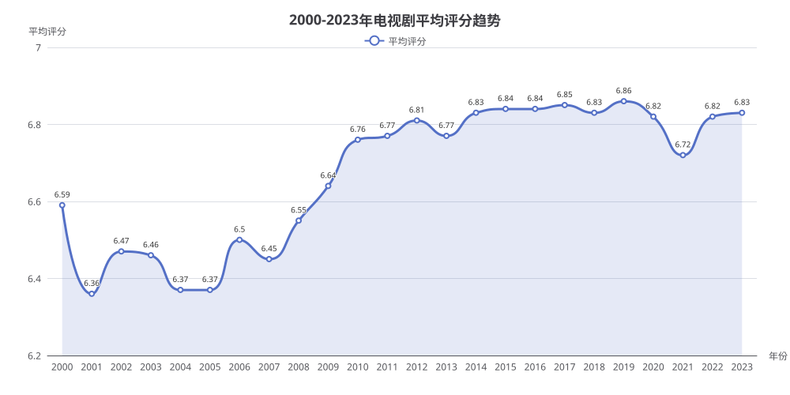

# 2000-2023 年电视剧平均评分趋势分析报告

> 生成时间：2026-08-05 17:10:17
> 数据来源：IMDb 数据库（imdb）

## 1. 概述

本报告基于 IMDb 数据库，分析 **2000-2023 年每一年电视剧（tvSeries）的平均评分趋势**。通过按年份分组计算 `AVG(average_rating)`，揭示电视剧质量随时间的演变规律。

## 2. 核心数据

| 年份 | 平均评分 | 年份 | 平均评分 |
|:---:|:---:|:---:|:---:|
| 2000 | 6.59 | 2012 | 6.81 |
| 2001 | 6.36 | 2013 | 6.77 |
| 2002 | 6.47 | 2014 | 6.83 |
| 2003 | 6.46 | 2015 | 6.84 |
| 2004 | 6.37 | 2016 | 6.84 |
| 2005 | 6.37 | 2017 | 6.85 |
| 2006 | 6.50 | 2018 | 6.83 |
| 2007 | 6.45 | 2019 | 6.86 |
| 2008 | 6.55 | 2020 | 6.82 |
| 2009 | 6.64 | 2021 | 6.72 |
| 2010 | 6.76 | 2022 | 6.82 |
| 2011 | 6.77 | 2023 | 6.83 |

## 3. 图表展示



## 4. 生成 SQL

```sql
SELECT start_year, AVG(average_rating) AS avg_rating
FROM titles
WHERE title_type = 'tvSeries'
  AND start_year BETWEEN 2000 AND 2023
  AND average_rating IS NOT NULL
GROUP BY start_year
ORDER BY start_year
```

> 说明：通过 `run_sql` 的 `limit` 参数控制返回行数，SQL 中未写 LIMIT 子句。

## 5. 分析解读

### 5.1 整体趋势

- **整体上升**：电视剧平均评分从 2000 年的 **6.59** 逐步上升到 2019 年的峰值 **6.86**，24 年间整体呈上升趋势，累计提升约 0.27 分。
- **增长阶段**：2000-2010 年是快速上升期（6.59 → 6.76），2010 年后进入高位稳定期。

### 5.2 关键节点

| 阶段 | 年份 | 特征 |
|:---|:---|:---|
| **低谷期** | 2001（6.36）、2004-2005（6.37） | 评分最低的时期 |
| **快速上升期** | 2008-2010（6.55 → 6.76） | 两年内提升 0.21 分 |
| **黄金期** | 2014-2019（6.83-6.86） | 评分稳定在高位区间 |
| **峰值** | 2019（6.86） | 24 年最高点 |
| **近期波动** | 2020-2021（6.82 → 6.72） | 明显回落，2021 年跌至 6.72 |
| **回升期** | 2022-2023（6.82-6.83） | 逐步恢复至高位 |

### 5.3 关键发现

1. **质量持续提升**：24 年间电视剧整体质量稳步上升，反映了行业制作水平的进步。
2. **2010 年代是黄金时代**：2014-2019 年评分稳定在 6.83-6.86，是电视剧质量最高的时期，与"美剧黄金时代"（流媒体崛起）的时间段吻合。
3. **2021 年异常回落**：2021 年评分跌至 6.72，可能是疫情导致制作质量波动或数据样本变化所致。
4. **近期企稳**：2022-2023 年评分回升至 6.82-6.83，显示行业已恢复稳定。

## 6. 附录

### 6.1 查询执行信息

- **执行策略**：策略A（标准流水线，含聚合 GROUP BY）
- **涉及表**：`titles`
- **过滤条件**：`title_type = 'tvSeries'` AND `start_year BETWEEN 2000 AND 2023` AND `average_rating IS NOT NULL`
- **聚合方式**：按 `start_year` 分组计算 `AVG(average_rating)`
- **返回行数**：24 行
- **执行耗时**：约 16 分 27 秒
- **性能优化**：已执行，无问题
