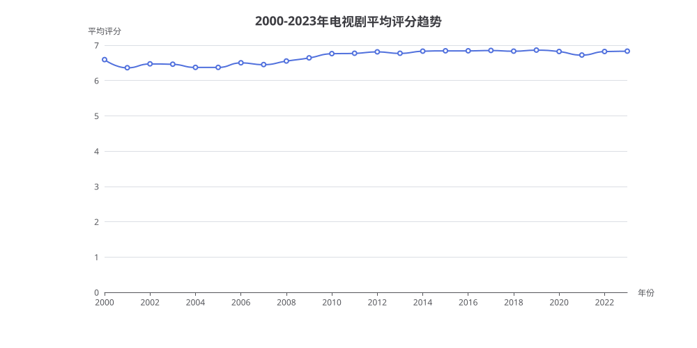

# 2000-2023年电视剧平均评分趋势分析报告

> 生成时间：2026-08-05 17:13:25
> 数据来源：IMDb 数据库（titles 表，title_type='tvSeries'）

## 1. 概述

本报告分析了 2000 年至 2023 年间，IMDb 数据库中每年电视剧（tvSeries）的平均评分变化趋势。通过按年份分组统计电视剧的平均评分，揭示了过去 24 年间电视剧整体质量水平的演变规律。

## 2. 核心数据

| 年份 | 平均评分 | 年份 | 平均评分 |
|:---:|:---:|:---:|:---:|
| 2000 | 6.59 | 2012 | 6.81 |
| 2001 | 6.36 | 2013 | 6.77 |
| 2002 | 6.47 | 2014 | 6.83 |
| 2003 | 6.46 | 2015 | 6.84 |
| 2004 | 6.37 | 2016 | 6.84 |
| 2005 | 6.37 | 2017 | 6.85 |
| 2006 | 6.50 | 2018 | 6.83 |
| 2007 | 6.45 | 2019 | 6.86 |
| 2008 | 6.55 | 2020 | 6.82 |
| 2009 | 6.64 | 2021 | 6.72 |
| 2010 | 6.76 | 2022 | 6.82 |
| 2011 | 6.77 | 2023 | 6.83 |

## 3. 生成SQL

```sql
SELECT t.start_year AS year,
       ROUND(AVG(t.average_rating), 2) AS avg_rating
FROM titles t
WHERE t.title_type = 'tvSeries'
  AND t.start_year BETWEEN 2000 AND 2023
  AND t.start_year IS NOT NULL
  AND t.average_rating IS NOT NULL
GROUP BY t.start_year
ORDER BY t.start_year ASC
```

## 4. 分析解读

### 4.1 整体趋势

2000-2023 年间，电视剧平均评分呈现**整体上升趋势**，从 2000 年的 6.59 逐步攀升至 2019 年的峰值 6.86，24 年间累计提升约 0.27 分。

### 4.2 关键阶段划分

- **低谷期（2001-2005）**：平均评分在 6.36-6.50 之间波动，其中 2001 年（6.36）和 2004-2005 年（6.37）为整个周期的最低点。
- **稳步上升期（2006-2011）**：评分从 6.50 稳步攀升至 6.77，年均增长约 0.05 分，反映了电视剧制作水平的持续提升。
- **黄金期（2014-2019）**：评分稳定在 6.83-6.86 的高位区间，是电视剧质量最好的时期，2019 年达到峰值 6.86。
- **近期波动（2020-2023）**：2020 年（6.82）和 2021 年（6.72）略有回落，2022-2023 年回升至 6.82-6.83。

### 4.3 趋势解读

- **质量提升**：整体上升趋势表明电视剧制作水准在过去 24 年间持续改善，可能与流媒体平台崛起带来的内容竞争加剧有关。
- **黄金时代**：2014-2019 年被称为"电视黄金时代"，与《权力的游戏》《绝命毒师》等高质量剧集集中涌现的时间段吻合。
- **近期回落**：2021 年的回落可能与疫情后内容供给变化、观众评分标准变化等因素相关，但整体仍处于较高水平。

## 5. 附录

### 5.1 图表



### 5.2 查询执行信息

- **执行策略**：策略A（标准流水线）
- **执行步骤**：knowledge-loader → schema-linking → subproblem → query-plan → sql-generation → run_sql
- **执行耗时**：53 秒
- **SQL 验证**：已通过 dry_run 验证，性能优化检查无问题（单表聚合查询，无性能隐患）
