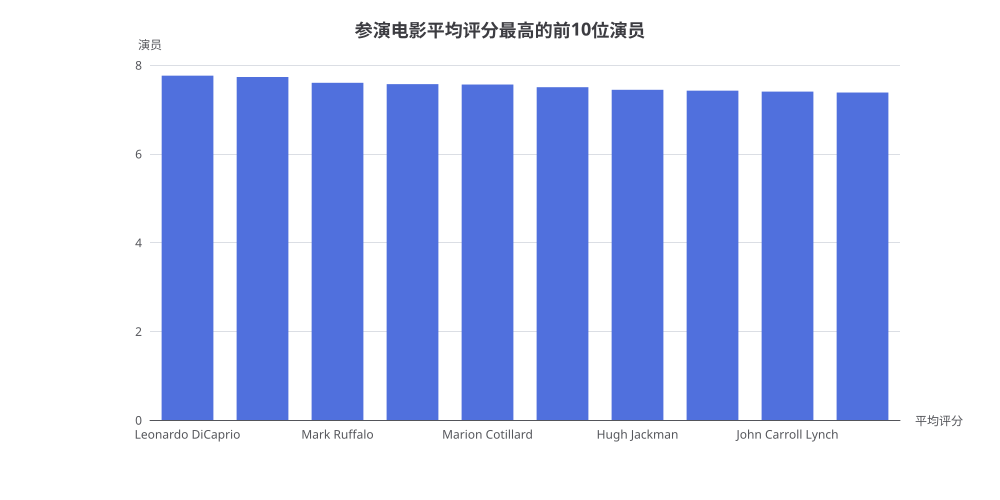

# 参演电影平均评分最高的前10位演员分析报告

> 生成时间：2026-08-05 17:17:31
> 数据来源：IMDb 数据库（names / principals / titles 表）

## 1. 概述

本报告分析了参演电影平均评分最高的前 10 位演员。筛选条件为：参演电影数 ≥ 5，且每部参演电影的投票数 > 50000。通过关联演员表（names）、演职人员表（principals）和电影表（titles），计算每位演员参演电影的平均评分并排序。

## 2. 核心数据

| 排名 | 演员姓名 | 参演电影数 | 平均评分 |
|:---:|:---|:---:|:---:|
| 1 | Leonardo DiCaprio | 7 | 7.76 |
| 2 | Zendaya | 6 | 7.73 |
| 3 | Mark Ruffalo | 6 | 7.60 |
| 4 | Domhnall Gleeson | 7 | 7.57 |
| 5 | Marion Cotillard | 5 | 7.56 |
| 6 | Timothée Chalamet | 6 | 7.50 |
| 7 | Hugh Jackman | 8 | 7.44 |
| 8 | Marisa Tomei | 5 | 7.42 |
| 9 | John Carroll Lynch | 7 | 7.40 |
| 10 | Christopher Plummer | 5 | 7.38 |

## 3. 生成SQL

```sql
SELECT n.primary_name AS 演员姓名,
  COUNT(DISTINCT p.title_id) AS 参演电影数,
  ROUND(AVG(t.average_rating), 2) AS 平均评分
FROM names n
JOIN principals p ON p.name_id = n.id
JOIN titles t ON t.id = p.title_id
WHERE p.category_id IN ('actor', 'actress')
  AND t.title_type = 'movie'
  AND t.num_votes > 50000
GROUP BY n.id, n.primary_name
HAVING COUNT(DISTINCT p.title_id) >= 5
ORDER BY 平均评分 DESC
```

## 4. 分析解读

### 4.1 榜单特点

- **榜首**：Leonardo DiCaprio 以 7.76 的平均评分位居第一，参演 7 部高投票电影，包括《盗梦空间》《荒野猎人》《华尔街之狼》等经典作品。
- **新生代演员**：Zendaya（7.73）和 Timothée Chalamet（7.50）作为新生代演员代表上榜，反映了近年高质量电影中年轻演员的出色表现。
- **实力派演员**：Mark Ruffalo（7.60）、Hugh Jackman（7.44）、Marisa Tomei（7.42）等实力派演员凭借稳定的选片眼光上榜。

### 4.2 数据特征

- **参演电影数**：榜单中演员参演电影数在 5-8 部之间，Hugh Jackman 以 8 部居首。
- **评分区间**：前 10 位演员的平均评分集中在 7.38-7.76 之间，差距约 0.38 分。
- **筛选条件影响**：投票数 > 50000 的过滤条件确保了统计基于高关注度电影，避免了小众电影对评分的干扰。

### 4.3 洞察

- **选片眼光**：上榜演员普遍具有出色的选片眼光，倾向于参与高质量、高关注度的电影项目。
- **评分稳定性**：参演电影数 ≥ 5 的要求保证了评分的统计可靠性，避免了仅凭 1-2 部电影上榜的偶然性。

## 5. 附录

### 5.1 图表



### 5.2 查询执行信息

- **执行策略**：策略A（标准流水线）
- **执行步骤**：knowledge-loader → schema-linking → subproblem → query-plan → sql-generation → run_sql
- **执行耗时**：2 分 13 秒
- **SQL 验证**：已通过 dry_run 验证
- **关联表**：names（演员）、principals（演职人员）、titles（电影）
