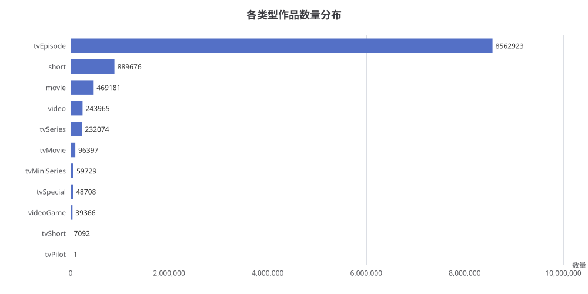

# 各类型作品数量分布分析报告

> 生成时间：2026-08-05_16-38-30
> 数据来源：IMDb 数据库（imdb）

## 1. 概述

本报告统计了 IMDb 数据库中 `titles` 表按 `title_type`（作品类型）分组的作品数量，并按数量降序排列，以了解不同类型作品在数据库中的分布情况。

## 2. 核心数据

| 类型 (title_type) | 数量 |
|------------------|------|
| tvEpisode（剧集） | 8,562,923 |
| short（短片） | 889,676 |
| movie（电影） | 469,181 |
| video（录像带/数字发行） | 243,965 |
| tvSeries（电视剧系列） | 232,074 |
| tvMovie（电视电影） | 96,397 |
| tvMiniSeries（迷你剧） | 59,729 |
| tvSpecial（电视特辑） | 48,708 |
| videoGame（电子游戏） | 39,366 |
| tvShort（电视短片） | 7,092 |
| tvPilot（试播集） | 1 |

**合计：** 10,649,112 条作品记录

## 3. 生成 SQL

```sql
SELECT title_type, COUNT(*) AS movie_count
FROM titles
GROUP BY title_type
ORDER BY movie_count DESC
```

## 4. 分析解读

### 4.1 数据分布特征

- **剧集（tvEpisode）占据绝对主导地位**，数量高达 856 万条，占全部作品的 **80.4%**。这反映了 IMDb 数据库以电视剧单集记录为主的特点。
- **短片（short）** 以 88.9 万条位居第二，占比约 8.4%。
- **电影（movie）** 以 46.9 万条位居第三，占比约 4.4%。

### 4.2 长尾分布

数据呈现明显的**长尾分布**特征：
- 前 3 大类型（tvEpisode、short、movie）合计占比超过 93%
- 其余 8 种类型合计占比不足 7%
- 试播集（tvPilot）仅 1 条记录，属于极少数情况

### 4.3 类型多样性

数据库覆盖了 11 种作品类型，涵盖电视剧、电影、短片、电子游戏、电视特辑等多种媒体形式，体现了 IMDb 作为综合性影视数据库的广度。

## 5. 附录

### 5.1 图表



### 5.2 查询说明

- 查询使用策略 B（快速通道）完成
- 针对 `titles` 表按 `title_type` 字段分组统计
- 结果按数量降序排列，共返回 11 行
