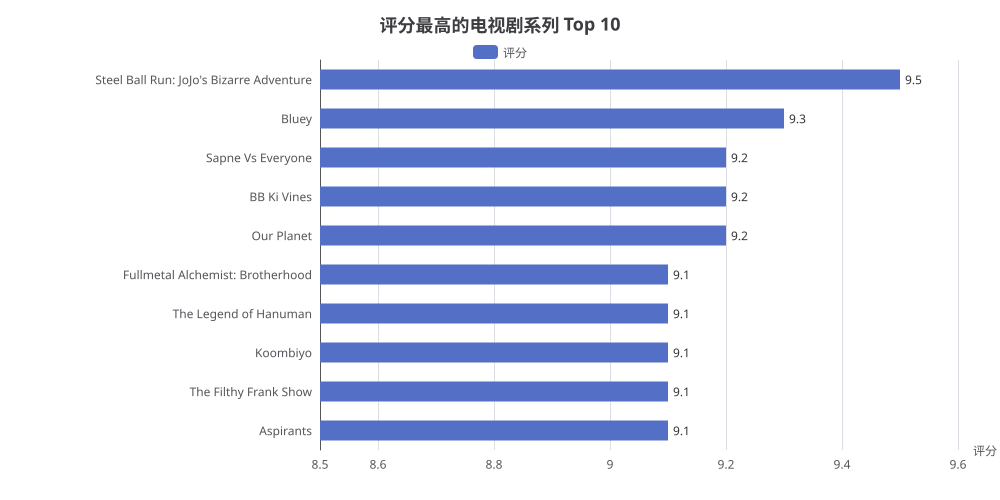

# 评分最高的电视剧系列（tvSeries）Top 10 分析报告

> 生成时间：2026-08-05 16:52:02
> 数据来源：IMDb 数据库（imdb）

## 1. 概述

本报告基于 IMDb 数据库，查询**评分最高的电视剧系列（tvSeries）前 10 名**。为确保评分可靠性，查询时添加了 `num_votes > 10000` 的过滤条件，仅统计投票数超过 1 万的电视剧系列。

## 2. 核心数据

| 排名 | 电视剧系列名称 | 评分 |
|:---:|:---|:---:|
| 1 | Steel Ball Run: JoJo's Bizarre Adventure | 9.5 |
| 2 | Bluey | 9.3 |
| 3 | Sapne Vs Everyone | 9.2 |
| 4 | BB Ki Vines | 9.2 |
| 5 | Our Planet | 9.2 |
| 6 | Fullmetal Alchemist: Brotherhood | 9.1 |
| 7 | The Legend of Hanuman | 9.1 |
| 8 | Koombiyo | 9.1 |
| 9 | The Filthy Frank Show | 9.1 |
| 10 | Aspirants | 9.1 |

## 3. 图表展示



## 4. 生成 SQL

```sql
SELECT primary_title, average_rating
FROM titles
WHERE title_type = 'tvSeries'
  AND num_votes > 10000
ORDER BY average_rating DESC
```

> 说明：通过 `run_sql` 的 `limit=10` 参数控制返回前 10 名，SQL 中未写 LIMIT 子句。

## 5. 分析解读

### 5.1 评分分布

- **最高分**：`Steel Ball Run: JoJo's Bizarre Adventure` 以 **9.5** 分位居榜首，是唯一一部评分超过 9.4 的电视剧系列。
- **第二梯队**：`Bluey`（9.3 分）紧随其后，是唯一进入前 3 的儿童动画系列。
- **第三梯队**：`Sapne Vs Everyone`、`BB Ki Vines`、`Our Planet` 三部并列 **9.2** 分。
- **第四梯队**：其余 5 部作品均以 **9.1** 分并列。

### 5.2 类型多样性

Top 10 榜单涵盖了多种题材：
- **动画/动漫**：Steel Ball Run、Bluey、Fullmetal Alchemist: Brotherhood
- **纪录片**：Our Planet
- **喜剧/娱乐**：BB Ki Vines、The Filthy Frank Show、Sapne Vs Everyone
- **剧情/其他**：The Legend of Hanuman、Koombiyo、Aspirants

### 5.3 关键发现

1. **评分高度集中**：Top 10 的评分区间为 9.1~9.5，差距仅 0.4 分，说明顶级电视剧系列的质量非常接近。
2. **动画类表现突出**：3 部动画/动漫作品进入前 10，其中 2 部进入前 3，显示动画类作品在 IMDb 上口碑普遍较高。
3. **地域多样性**：榜单涵盖日本（JoJo）、澳大利亚（Bluey）、印度（Sapne Vs Everyone、BB Ki Vines、Aspirants）、英国（Our Planet）、斯里兰卡（Koombiyo）等多国作品。

## 6. 附录

### 6.1 查询执行信息

- **执行策略**：策略B（快速通道）— 单表简单查询
- **涉及表**：`titles`
- **过滤条件**：`title_type = 'tvSeries'` AND `num_votes > 10000`
- **排序方式**：`average_rating` 降序
- **返回行数**：10 行
- **执行耗时**：约 45 秒
